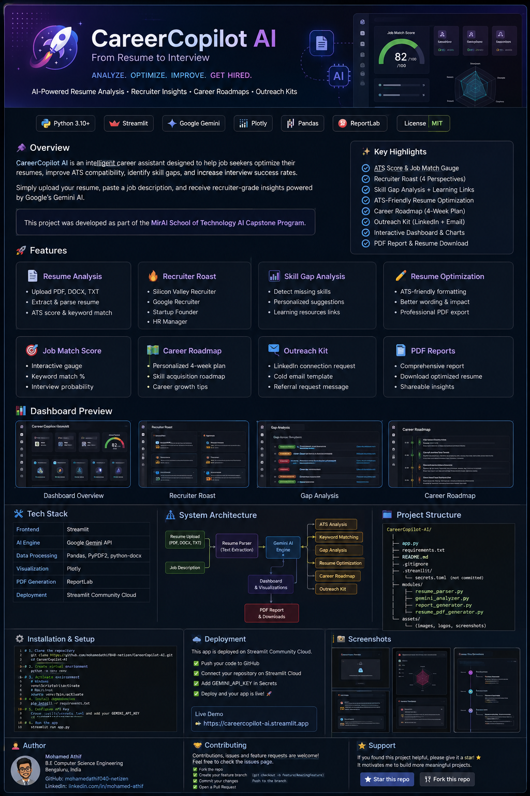
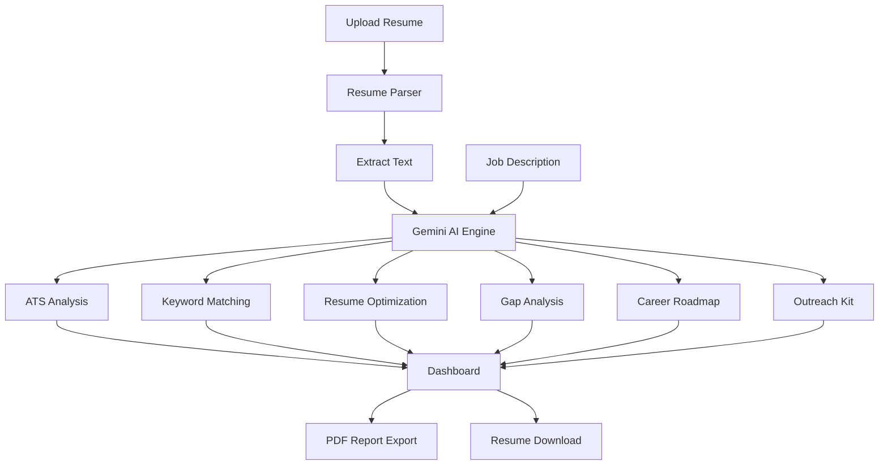
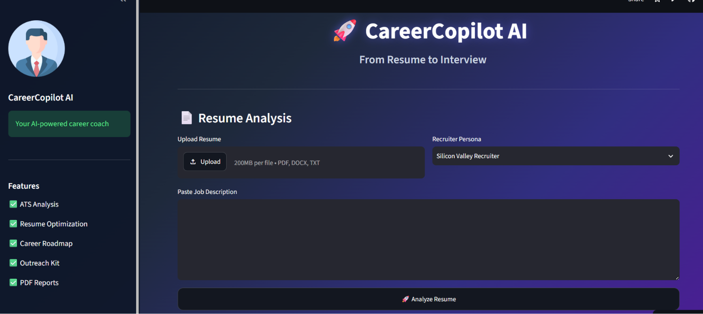

<p align="center">
  
</p>

# 🚀 CareerCopilot AI

<div align="center">

### Transform Your Resume Into Interview Opportunities

AI-Powered Resume Analyzer • ATS Optimizer • Career Roadmap Generator • Outreach Assistant


</div>

---

## 📌 Overview

**CareerCopilot AI** is an intelligent career assistant designed to help job seekers optimize their resumes, improve ATS compatibility, identify skill gaps, and increase interview success rates.

Simply upload your resume, paste a job description, and receive recruiter-grade insights powered by Google's Gemini AI.

This project was developed as part of the **MirAI School of Technology AI Capstone Program**.

---

## ✨ Features

### 📄 Resume Analysis
- Upload PDF, DOCX, or TXT resumes
- Automatic resume text extraction
- ATS compatibility scoring
- Keyword matching analysis

### 🔥 Recruiter Roast
- Simulates feedback from:
  - Silicon Valley Recruiter
  - Google Recruiter
  - Startup Founder
  - HR Manager
- Identifies weak sections and missing impact

### 📈 Skill Gap Analysis
- Detects missing skills from the job description
- Generates personalized improvement recommendations
- Learning resource suggestions

### ✍️ Resume Optimization
- Creates an ATS-friendly optimized resume
- Improves formatting and wording
- Enhances professional presentation

### 🎯 Job Match Score
- Interactive KPI Dashboard
- ATS Score
- Keyword Match %
- Missing Skills Count
- Interview Probability

### 🗺️ Career Roadmap Generator
- Personalized 4-week improvement plan
- Skill acquisition roadmap
- Career growth recommendations

### 📩 Outreach Kit
Generates:
- LinkedIn Connection Request
- Cold Email Template
- Referral Request Message

### 📊 Interactive Visualizations
- Radar Chart Analysis
- Job Match Gauge
- Application Readiness Meter
- KPI Metrics Dashboard

### 📄 PDF Export
- Download professional analysis reports
- Export optimized resume as PDF

---

## 🏗️ System Architecture



---

## 🖥️ Dashboard Preview



---

### Main Features

✅ ATS Score Dashboard

✅ Recruiter Roast

✅ Gap Analysis

✅ Resume Optimization

✅ Career Roadmap

✅ Outreach Kit

✅ PDF Reports

✅ Interactive Visualizations

---

## 🛠️ Tech Stack

### Frontend
- Streamlit

### AI Engine
- Google Gemini API
- Prompt Engineering

### Data Processing
- Pandas
- PyPDF2
- Python-docx

### Visualization
- Plotly

### PDF Generation
- ReportLab

### Deployment
- Streamlit Community Cloud

---

## 📂 Project Structure

```text
CareerCopilot-AI/
│
├── app.py
├── requirements.txt
├── README.md
├── .gitignore
│
├── modules/
│   ├── resume_parser.py
│   ├── gemini_analyzer.py
│   ├── report_generator.py
│   └── resume_pdf_generator.py
│
└── assets/
```

---

## ⚙️ Installation

### Clone Repository

```bash
git clone https://github.com/yourusername/CareerCopilot-AI.git

cd CareerCopilot-AI
```

### Create Virtual Environment

```bash
python -m venv venv
```

### Activate Environment

Windows:

```bash
venv\Scripts\activate
```

Mac/Linux:

```bash
source venv/bin/activate
```

### Install Dependencies

```bash
pip install -r requirements.txt
```

---

## 🔑 Configure Gemini API

Create:

```text
.streamlit/secrets.toml
```

Add:

```toml
GEMINI_API_KEY="YOUR_API_KEY"
```

---

## ▶️ Run Locally

```bash
streamlit run app.py
```

---

## ☁️ Live Demo

https://careercopilot-ai-athif.streamlit.app/

---

## 📊 Evaluation Highlights

This project demonstrates:

- Advanced Streamlit UI Development
- Session State Management
- Gemini AI Integration
- Prompt Engineering
- Data Visualization
- PDF Generation
- Cloud Deployment
- GitHub Best Practices

---

## 🚀 Future Enhancements

- Live Job Search Integration
- LinkedIn Profile Analyzer
- AI Mock Interview Simulator
- Recruiter Database Matching
- Multi-Language Resume Support
- Resume Version Comparison
- Interview Question Generator

---

## 👨‍💻 Author

**Mohamed Athif**

B.E Computer Science Engineering

Bengaluru, India

GitHub: https://github.com/mohamedathif040-netizen/CareerCopilot-AI

LinkedIn: https://www.linkedin.com/in/mohamed-athif-a674ab416

---

## ⭐ Support

If you found this project useful:

⭐ Star the repository

🍴 Fork the project

📢 Share with others

---

<div align="center">

### 🚀 CareerCopilot AI
### From Resume to Interview

Built with ❤️ using Streamlit + Gemini AI

</div>